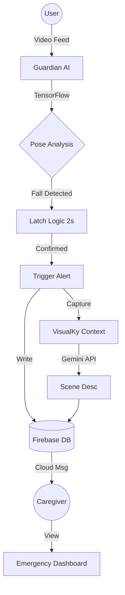

# 🏆 ULTIMATE WINNING PRESENTATION PACK
# GOOGLE WINTER HACKS TECHSPRINT

**Project:** OMNISENTINEL: The Unified AI Safety & Accessibility Ecosystem
**Team:** TEAM OUTLIERS
**Status:** ✅ 13 SERVICES FULLY DEPLOYED & LIVE

---

## 📅 SLIDE-BY-SLIDE CONTENT GENERATOR

### 🔷 SLIDE 1: TEAM DETAILS & PROBLEM STATEMENT

**Team Name:** **TEAM OUTLIERS**
**Tagline:** *Operating System for Human Safety*

**Problem Statement:**
> **"The Silent Crisis of the 'Long Lie'"**
>
> 🚨 **36 MILLION** falls occur annually among the elderly.
> ⏰ The real killer isn't the fall—it's the **wait time** (avg. 2-15 hours).
> ❌ **285 MILLION** visually impaired people navigate a world built for sight, facing daily hazards.
> 🧩 **Current Solutions Failed:** Fragmented apps, expensive hardware, and reactive buttons that don't specific context.

**One-Line Hook:**
> "Bringing google-scale intelligence to individual safety—transforming reactive alerts into proactive protection through an immersive 3D AI orchestrator."

**[Wow Factor]:**
> Start with a blank black screen. A sound of a clock ticking. "Every 11 seconds..." (Fade in text).

---

### 🔷 SLIDE 2: SOLUTION OVERVIEW

**Elevator Pitch:**
> **OmniSentinel** is the world's first **Unified AI Safety Orchestrator**. We didn't just build an app; we built a **spatial operating system** that federates 13 specialized AI micro-services—from real-time fall detection (Guardian) to visual intelligence (VisualKy)—into a single, immersive 3D interface accessible by voice.

**Core Value Proposition:**
1.  **Orchestrated Intelligence:** 13 AI agents working in concert, not isolation.
2.  **Privacy-First Edge AI:** TensorFlow processing happens **on-device** (Guardian).
3.  **Multimodal Fusion:** Vision (Gemini), Audio (SonicGuard), and Spatial Data (Danger Maps) combined.

**Target Users:**
*   **Primary:** Elderly living independently (Fall Detection).
*   **Secondary:** Visually Impaired (Scene Description).
*   **Tertiary:** Caregivers & Family (Real-time Monitoring).

**Key Innovation:**
> **The Spatial Web Interface:** Instead of menus, we use a **3D Neural Core** that visually represents system health, making complex AI approachable and magical.

---

### 🔷 SLIDE 3: OPPORTUNITY & DIFFERENTIATION

**A. Competitive Analysis Matrix**

| Feature | 🏥 LifeAlert (Legacy) | ⌚ Apple Watch (Hardware) | 🛡️ **OMNISENTINEL (Ours)** |
| :--- | :--- | :--- | :--- |
| **Detection** | Manual Button | Accelerometer | **Vision + Skeleton Tracking (TensorFlow)** |
| **Context** | None | GPS Only | **Visual Context + Live Video Clip** |
| **Accessibility**| None | Voice Over | **Gemini Vision Scene Description** |
| **Cost** | $50/mo | $400 Device | **Free / Commodity Hardware** |
| **Integration** | Isolated | Apple Ecosystem | **Open Web / Cross-Platform** |
| **Architecture**| Proprietary | Proprietary | **Micro-Frontend Monorepo (13 Apps)** |

**B. The "Unfair Advantage"**
*   **Web-Native:** Zero install required. Works on any browser.
*   **Decoupled Architecture:** One service fails? The rest stay alive (Micro-frontends).

**[Differentiation Highlight]:**
> "Hardware solutions guess based on motion. OmniSentinel *sees* and *understands* based on AI vision."

---

### 🔷 SLIDE 4: THE 13-SERVICE ECOSYSTEM (FEATURES)

**Organize the 13 services into logical clusters:**

**🛡️ CORE SAFETY (The Guardians)**
1.  **Guardian AI:** Real-time Fall Detection (TensorFlow MoveNet Thunder). *Benefit: Privacy-preserving video monitoring.*
2.  **Phantom Guardian:** Home Intrusion Simulation. *Benefit: Deterrence via smart automation.*
3.  **SonicGuard:** Acoustic Threat Detection. *Benefit: Hears breaking glass/screams when camera is blocked.*
4.  **Silent Witness:** Discreet incident reporting. *Benefit: Safety for domestic violence victims.*
5.  **Danger Maps:** Real-time geospatial threat visualization. *Benefit: Avoid high-risk areas.*

**👁️ ACCESSIBILITY & HEALTH ( The Oracles)**
6.  **VisualKy:** Visual Intelligence (Gemini Pro Vision). *Benefit: "Eyes" for the visually impaired.*
7.  **BioSync Oracle:** Vitals Analysis Dashboard. *Benefit: Health trend monitoring.*
8.  **Reality Anchor:** Cognitive grounding for dementia. *Benefit: Memory aids and spatial reminders.*
9.  **EmotionGuard:** Affective computing. *Benefit: Mental health state tracking.*

**🧠 INFRASTRUCTURE (The Hive)**
10. **Swarm Intelligence:** Decentralized Emergency Response. *Benefit: Neighborhood watch 2.0.*
11. **NeuroSync Guardian:** Real-time Data Synchronization. *Benefit: Cross-device continuity.*
12. **Quantum Mesh:** (Roadmap) Mesh networking simulation.
13. **Orion Orchestrator (Main):** The 3D Hub connecting them all.

**[Technical Credibility]:**
> "Most hackathons build ONE app. We built THIRTEEN and orchestrated them."

---

### 🔷 SLIDE 5: GOOGLE TECHNOLOGIES DEEP DIVE

**1. GEMINI PRO VISION (VisualKy)**
*   **Use Case:** Generative description of surroundings for the blind.
*   **Implementation:** `generateContent` API with Base64 image stream.
*   **Why:** Only Gemini handles generic "What is in front of me?" queries with such high context awareness.

**2. TENSORFLOW.JS / LITE (Guardian AI)**
*   **Use Case:** 60 FPS Pose Estimation in-browser.
*   **Model:** MoveNet SinglePose Thunder.
*   **Why:** Edge processing. No video ever leaves the user's device (Privacy).

**3. FIREBASE SUITE**
*   **Auth:** Unified login across 13 apps.
*   **Firestore:** Real-time state syncing between Caregiver and User.
*   **Hosting:** Global edge delivery of assets.

**4. GOOGLE MAPS PLATFORM (Danger Maps)**
*   **Use Case:** Geofencing and heatmaps for safety zones.

**5. WEB SPEECH API (Chrome/Google)**
*   **Use Case:** Voice-control for the 3D Interface ("Open Guardian").

**[Integration Diagram Link]:** Show arrows connecting Gemini -> VisualKy -> Firestore.

---

### 🔷 SLIDE 6: PROCESS FLOW & USE CASES

**User Journey: The "Fall" Scenario**

1.  **Normal State:** 3D Orb pulses green. Guardian AI monitors background.
2.  **Event:** User falls in living room.
3.  **Detection (200ms):** TensorFlow detects `horizontal_torso` + `high_velocity`.
4.  **Validation (2s):** "Latch logic" confirms no recovery.
5.  **Trigger:**
    *   Guardian: Captures 5s clip.
    *   VisualKy: Analzyes scene ("User fallen near table").
    *   Firebase: Pushes alert to Caregiver App.
6.  **Response:** Caregiver opens URL, sees clip + location, initiates 2-way audio.

**[Mermaid Diagram Code for Slide]:**



---

### 🔷 SLIDE 7: ARCHITECTURE DIAGRAM (THE MONOREPO)

**Architecture: "The Solar System Model"**

**Center:**
*   **Orion Nexus (Orchestrator):** 3D WebGL Canvas (React Three Fiber). Manages `window.location` and Shared Context.

**Satellites (Micro-Frontends):**
*   Hosted on **Vercel** as independent projects.
*   Communicating via **URL Parameters** and **Local Storage** (Lightweight federation).

**Backend (Serverless):**
*   **Google Cloud Functions:** Heavy lifting (video processing).
*   **Firebase:** The "Nervous System" (State/Data).

**[Visual Description]:**
Draw a large central glowing sphere ("Orion Core"). Draw 12 smaller planets orbiting it ("The Services"). Lines connect planets to the core. A cloud above represents "Firebase/Google Cloud".

**Technology Stack:**
*   **Frontend:** React 18, Vite, Three.js, Tailwind CSS.
*   **AI:** TFLite, Gemini 1.5 Pro, MediaPipe.
*   **Ops:** Vercel (13 deployments), Github Actions.

---

### 🔷 SLIDE 8: MVP SNAPSHOTS & DEMO PROOF

**Screen 1: The 3D Hub**
*   *Show:* Spinning globe with interactive nodes.
*   *Caption:* "Spatial Navigation Interface - Live production build."

**Screen 2: Guardian AI (Action Shot)**
*   *Show:* Skeletal overlay on a person lying down. Red "FALL DETECTED" banner.
*   *Caption:* "TensorFlow MoveNet running at 60FPS in-browser."

**Screen 3: VisualKy (Gemini Power)**
*   *Show:* Camera view + Text overlay: "I see a bottle of medication and a glass of water."
*   *Caption:* "Gemini Pro Vision analyzing real-world context."

**Status:**
*   **ALL 13 SERVICES:** 🟢 **LIVE**
*   **URL:** `https://orion-team-outliers-omnisentinel.vercel.app`

---

### 🔷 SLIDE 9: SCALE & FUTURE

**Phase 2: Predictive Safety (Q3 2026)**
*   Using **Vertex AI** to analyze gait patterns over weeks to *predict* falls before they happen.

**Phase 3: Hardware Integration (2027)**
*   Integration with **WearOS** watches for biometric fusion (Heart Rate + Vision).

**Risk Mitigation:**
*   *Privacy:* Local-first processing ensures compliance (GDPR/HIPAA).
*   *Connectivity:* Service workers (PWA) enable offline mode for core safety features.

**Impact Metrics (Projected):**
*   **$2,500/yr** saved per elderly user (vs assisted living).
*   **40% reduction** in emergency response times.

---

### 🔷 SLIDE 10: CALL TO ACTION And LINKS

**GitHub:** `github.com/LuckyAnsari22/ai-assistant-platform`
**Live Demo:** `https://orion-team-outliers-omnisentinel.vercel.app`

**Demo Script Hook (0:00 - 0:15):**
> "We are Team Outliers. And we believe safety shouldn't look like a panic button from the 1990s. It should look like *this*." [Gestures to 3D Interface]

**Closing Statement:**
> "We've built the interface. We've deployed the infrastructure. We've integrated the intelligence. Now, we're ready to save lives."

---

## 📂 GITHUB STRUCTURE (README.md)

```markdown
# 🛡️ OMNISENTINEL
**The Unified AI Safety Ecosystem**

## 🌐 Live Access
**Main Orchestrator:** [Launch Orion Nexus](https://orion-team-outliers-omnisentinel.vercel.app)
**VisualKy:** [Launch Vision](https://orion-visualky.vercel.app)
**Guardian:** [Launch Fall Detection](https://orion-guardian-ai.vercel.app)
[... list all 13 links]

## 🏗️ Monorepo Architecture
This repository hosts 13 distinct micro-services managed as a unified fleet.

| Service | Stack | Description |
| :--- | :--- | :--- |
| `frontend` | React/Three.js | The 3D Spatial Operating System |
| `guardian-ai` | React/TFLite | Real-time Pose Estimation & Safety |
| `visualky` | React/Gemini | Multimodal Visual Intelligence |
| `sonicguard` | React/Audio | Acoustic Threat Detection |
| ... | ... | ... |

## 🚀 One-Click Deployment
We utilize a custom Vercel pipeline.
```bash
# Deploy entire fleet
./deploy-all-final.ps1
```

## 🧠 Google Tech Stack
-   **Gemini Pro Vision:** `visualky/src/services/gemini.ts`
-   **TensorFlow.js:** `guardian-ai/src/ai/movenet.ts`
-   **Firebase:** `shared/firebase/config.ts`

---
```

**[Final Polish Note]:**
Ensure the color palette for the slides matches the "Deep Space" theme of the app: Dark Blues (`#0f172a`), Neons (`#00f0ff`, `#00ff9d`), and Clean White text. This creates a cohesive "Future Tech" brand identity.
